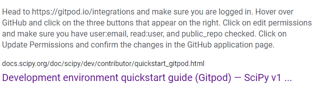

# Week 0 — Billing and Architecture

## Required Homework

### Install AWS CLI

Installed as per instructions in video. Ran into problem committing the code to my repository. 
Received the error **operation requires additional permissions: public_repo**
Utilized google to troubleshoot. Browsed to gitpodio integrations and edited
the permissions to user:email read:user and public_repo.

### Create Billing Alarm and Budgets

I created a billing alarm and Budget through the console while watching the pricing video. 
There is no code in my repository showing I did so through the CLI.

### add picture of Billing Alarm

### add picture of Budgets

###Recreate Conceptual Diagram in Lucid Chart

I recreated the Conceptual Diagram by following along with the video.

### add picture of Conceptual Diagram

I recreated the Logical Diagram by following the video and referencing the completed diagram.

### add picture of Logical Diagram

## Homework Challenges

### Set MFA

Created multiple Groups for the different functions or services seen in the logical diagram.

### add picture

### Created multiple users that are admins for specific job functions or services
rather than one Cloud Admin over everything. Trying to follow principle of least privilege.
Assigned each user to a different group.
Enabled MFA on all user accounts.

### add pictures
