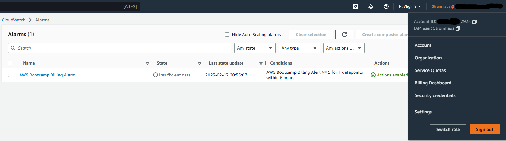
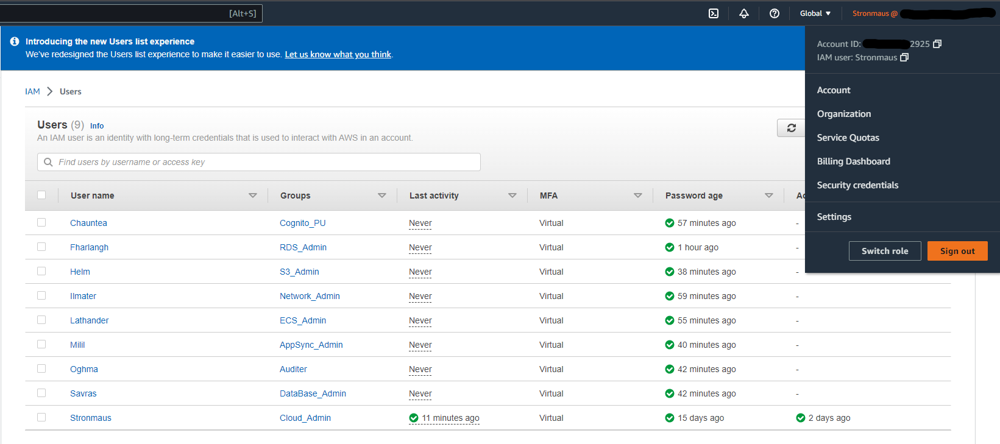
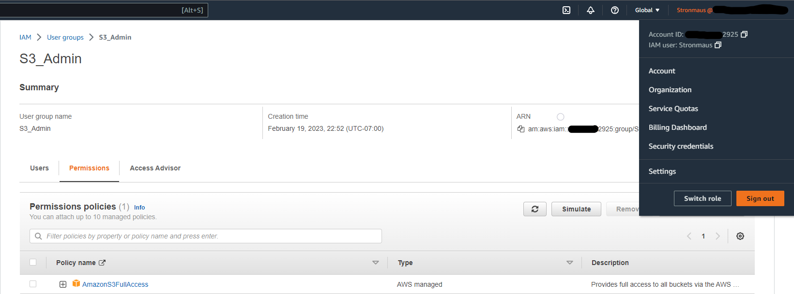
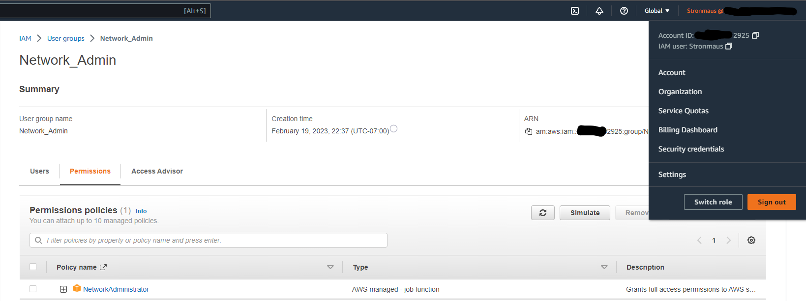
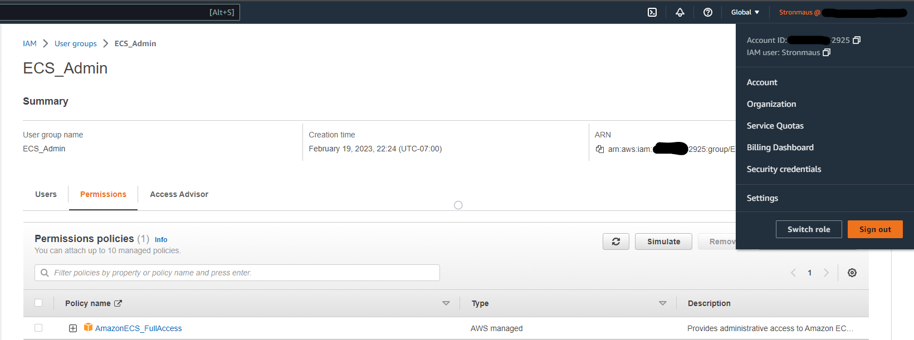
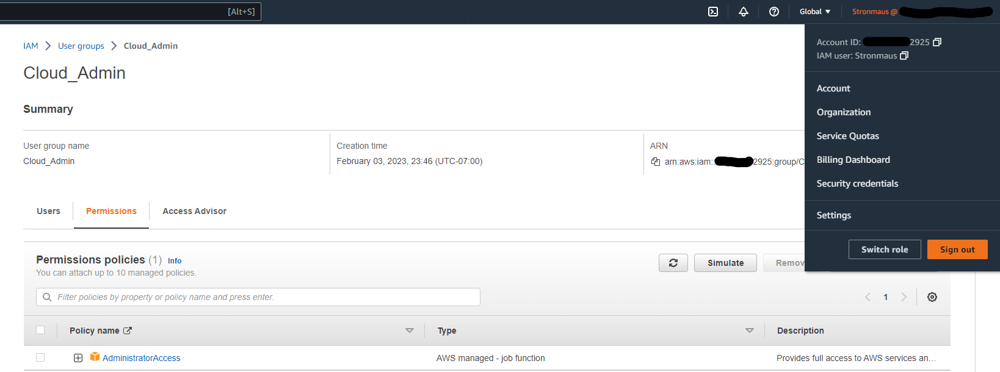

# Week 0 — Billing and Architecture

## Required Homework

### Install AWS CLI

Installed as per instructions in video. Ran into problem committing the code to my repository. 
Received the error: **operation requires additional permissions: public_repo**.
Utilized google to troubleshoot. Browsed to **gitpod.io\integrations** and edited
the permissions to **user:email read:user and public_repo**.

**Permissions Fix:**

### Create Billing Alarm and Budgets

I created a billing alarm and Budget through the console while watching the pricing video. 
There is no code in my repository showing I did so through the CLI.

**Billing Alarm:**

**Budgets:**

### Recreate Diagrams in Lucid Chart

I recreated the Conceptual Diagram by following along with the video.

**Conceptual Diagram:**

[Lucid Chart Conceptual Diagram](https://lucid.app/lucidchart/a9a05af5-60d4-492d-9d25-3ff40d236923/edit?viewport_loc=-580%2C-1447%2C2219%2C1065%2C0_0&invitationId=inv_76f9777f-030a-450d-86bd-8905a6f4068d)

I recreated the Logical Diagram by following the video and referencing the completed diagram.

**Logical Diagram:**

[Lucid Chard Logical Diagram](https://lucid.app/lucidchart/50860a83-52e8-4057-863b-bc07229a27d4/edit?viewport_loc=-223%2C143%2C2219%2C1065%2C0_0&invitationId=inv_c6b4c1db-f29f-41b9-bac7-f8f545777fa2)

## Homework Challenges

### Set MFA

**Set MFA on on Root and User Account:**

### Least Privilege

Created multiple Groups for the different functions or services seen in the logical diagram.
Created multiple users that are admins for specific job functions or services
rather than one Cloud Admin over everything. 
Assigned each user to a different group.
Enabled MFA on all user accounts.

**Users and Groups:**

### Group Permissions

Each group has a different set of permissions:

**Cognito Power User:**

**RDS Admin:**

**S3 Admin:**

**Network Admin:**

**ECS Admin:**

**AppSync Admin:**

**Auditer:**

**Database Admin:**

**Cloud Admin:**

