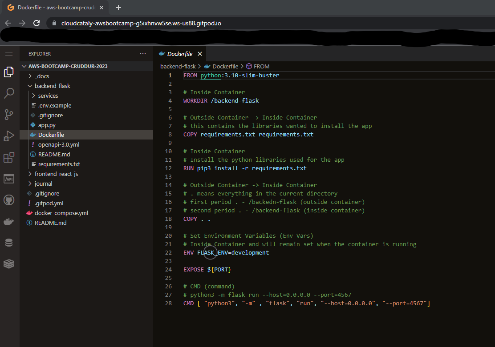
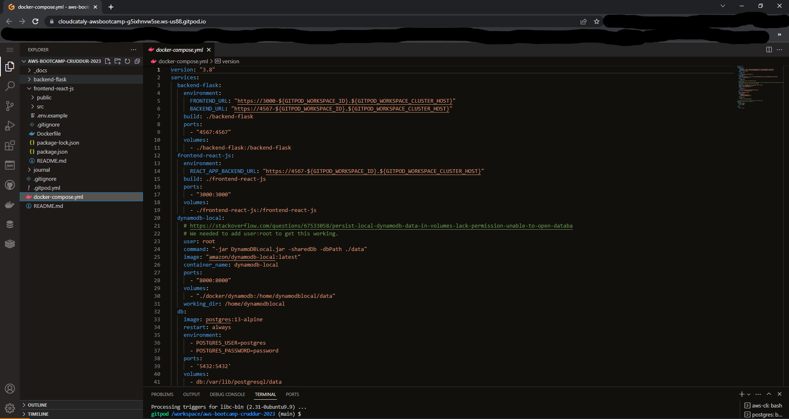
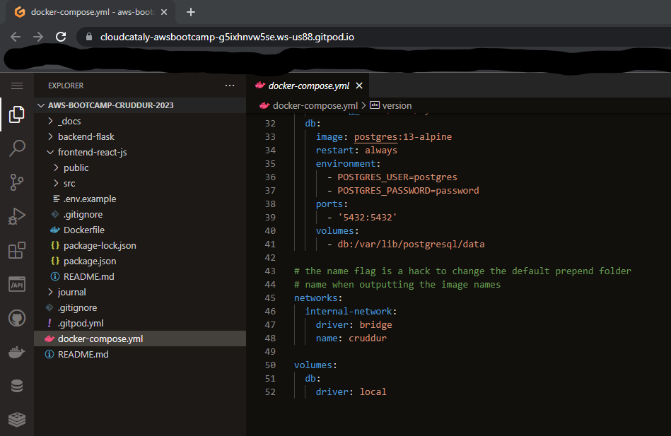

# Week 1 — App Containerization

## Containerizeing the Backend:

Created Dockerfile in backend-flask:

## Containerize the Frontend:

Created Dockerfile in frontend-react-js:

## Create a Docker Compose File in the root of project:

Created Docker Compose File:

## Adding Postgres:

Added Postgres container to Docker Compose File:

## Adding DynamoDB Local:

Added DynamoDB Local container to Docker Compose File:

## Volumes:

Added volume mapping:

## Homework Challenges:

None

## Troubleshooting:

AWS CLI:

Upon performing required homework, my gitpod project was not reflecting the AWS CLI as being installed.

At first I tried to manually install the AWS CLI in the terminal by copying and pasting files.

The output was repeatedly asking me if I wanted to overwrite each file. I used control C to exit the command. 

I verified that the installation files were downloaded in the proper directory.

I then closed out of Gitpod and reloaded my instance. The AWS CLI successfully installed and I verified with the aws --version command.

After this I had zero problems with AWS CLI.
